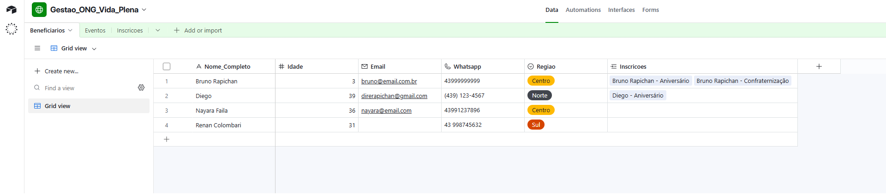
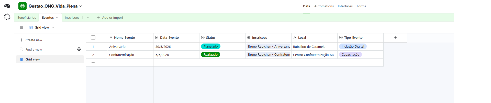
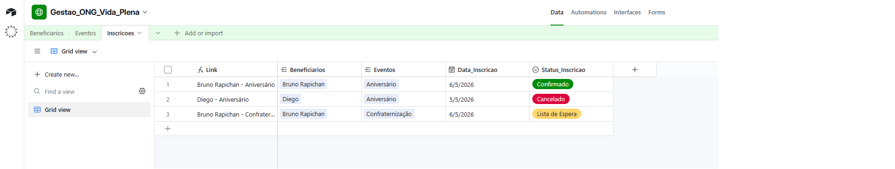
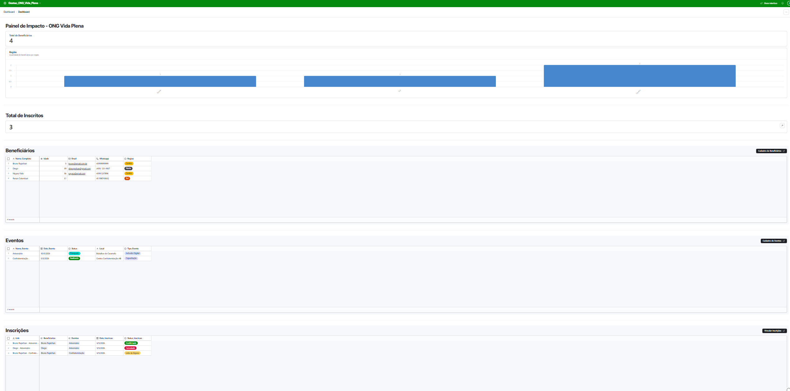
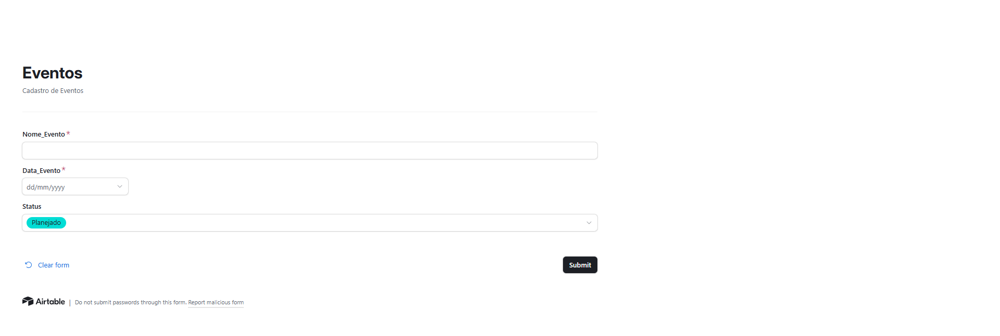
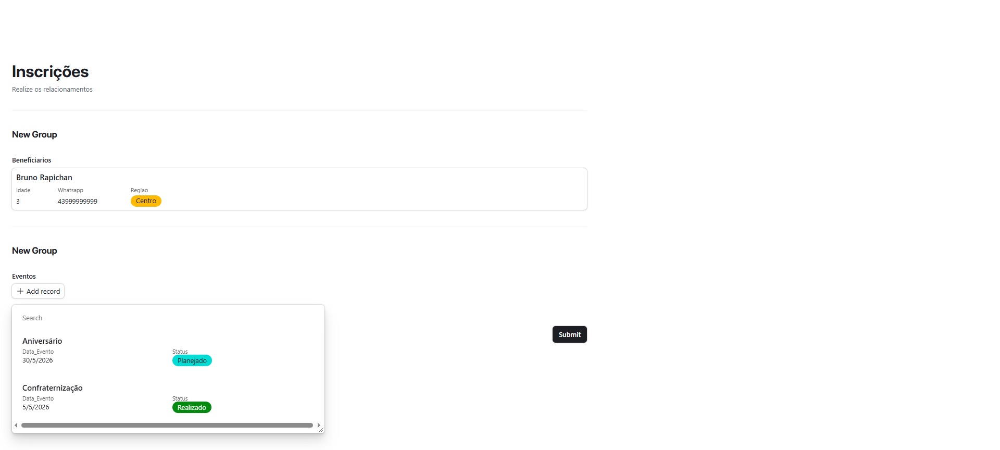
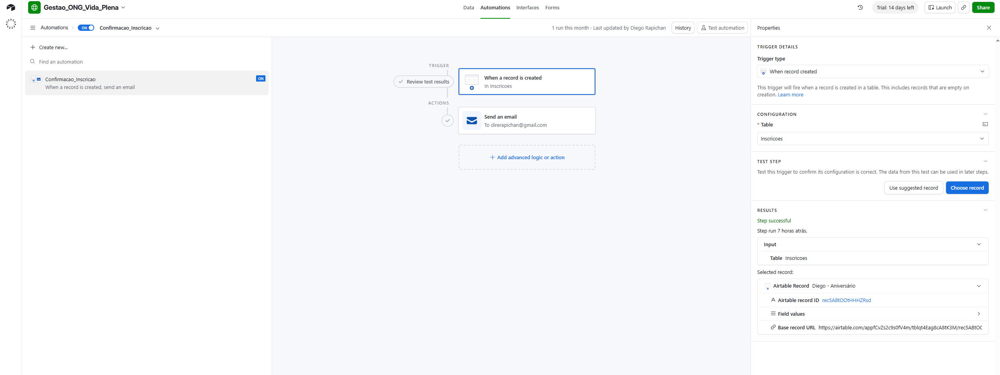
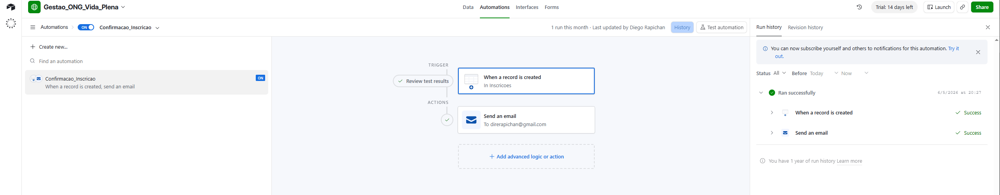
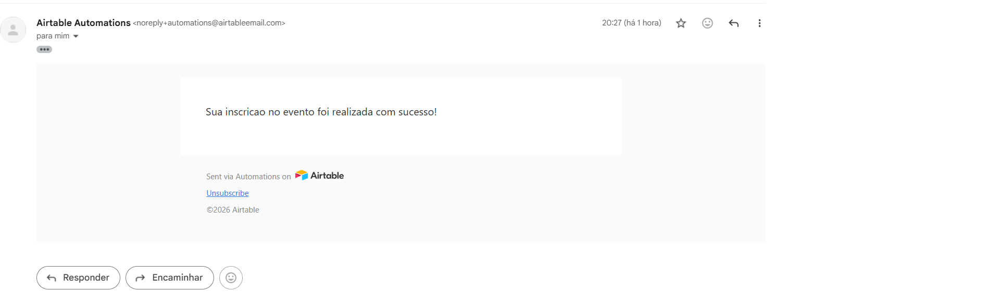

# 🌱 Gestão de Dados Visual – ONG Vida Plena

> Trabalho prático da disciplina **Banco de Dados e Integradas** – UniFECAF  
> Plataforma utilizada: **Airtable** (No-Code)  
> Autor: **Diego Colombari Rapichan**

---

## 📋 Sobre o projeto

A ONG Vida Plena atua há mais de 10 anos em comunidades periféricas da Grande São Paulo, promovendo eventos de inclusão digital, capacitação profissional e campanhas de saúde. Este projeto substitui o controle manual feito em planilhas e grupos de WhatsApp por um banco de dados visual estruturado, com automações e formulários acessíveis a qualquer membro da equipe — sem necessidade de programação.

---

## 🗂️ Estrutura do banco de dados

O banco é composto por **3 tabelas relacionadas** com relacionamento N:N entre Beneficiários e Eventos, mediado pela tabela Inscrições.

```
Beneficiarios ──< Inscricoes >── Eventos
```

| Tabela            | Campos principais                                                        |
| ----------------- | ------------------------------------------------------------------------ |
| **Beneficiarios** | Nome_Completo, Idade, Email, Whatsapp, Regiao                            |
| **Eventos**       | Nome_Evento, Data_Evento, Local, Tipo_Evento, Status                     |
| **Inscricoes**    | Link (fórmula), Beneficiarios, Eventos, Data_Inscricao, Status_Inscricao |

---

## 🖥️ Evidências do sistema

### 1. Tabela Beneficiários

> Print da tabela com os registros cadastrados, campos Nome_Completo, Idade, Email, Whatsapp e Regiao visíveis.



---

### 2. Tabela Eventos

> Print da tabela com os eventos cadastrados, campos Nome_Evento, Data_Evento, Local, Tipo_Evento e Status visíveis.



---

### 3. Tabela Inscrições (relacionamento N:N)

> Print da tabela de junção mostrando os linked records conectando Beneficiários e Eventos, com Data_Inscricao e Status_Inscricao.



---

### 4. Dashboard – Painel de Impacto

> Print do dashboard com o gráfico de beneficiários por região, contadores de total de beneficiários e total de inscritos.



---

## 📝 Formulários de entrada de dados

### 5. Formulário de Inscrição Online

> Formulário público para cadastro de novos beneficiários (Nome, Idade, Whatsapp, Região).


---

### 6. Formulário de Cadastro de Eventos

> Formulário para registro de novos eventos (Nome, Data, Status).



---

### 7. Formulário de Inscrições (relacionamento)

> Formulário para vincular um beneficiário existente a um evento.



---

## ⚡ Automação – Confirmação de Inscrição

### 8. Configuração da automação

> Print da tela de Automations mostrando a regra **Confirmacao_Inscricao** ativa (ON), com o trigger "When a record is created" na tabela Inscrições e a action "Send an email".



---

### 9. Histórico de execuções (prova de funcionamento)

> Print da aba **History** da automação mostrando ao menos uma execução bem-sucedida — evidência de que a automação rodou com dados reais.



---

### 10. Email Recebido

> Print do email recebido da automação mostrando ao menos uma execução bem-sucedida — evidência de que a automação rodou com dados reais.



---

## 🔗 Links

| Item                     | Link                                                                          |
| ------------------------ | ----------------------------------------------------------------------------- |
| Base pública no Airtable | [Acessar projeto](https://airtable.com/appfCvZs2c9s0fV4m/shrkjx3eR8jBHYrcH)   |
| Dashboard do Projeto     | [Acessar Dashboard](https://airtable.com/appfCvZs2c9s0fV4m/shr7hHwX6xFAyyGon) |
| Vídeo pitch (YouTube)    | [Acessar Vídeo](https://youtu.be/M-fhZcZFZvA)                                 |
| Parte Teórica (PDF)      | [Acessar Documento](teorica/parte_teorica_ong_vida_plena_Diego_Rapichan.pdf)  |

---

_Disciplina: Banco de Dados e Integradas · UniFECAF · 2026_
